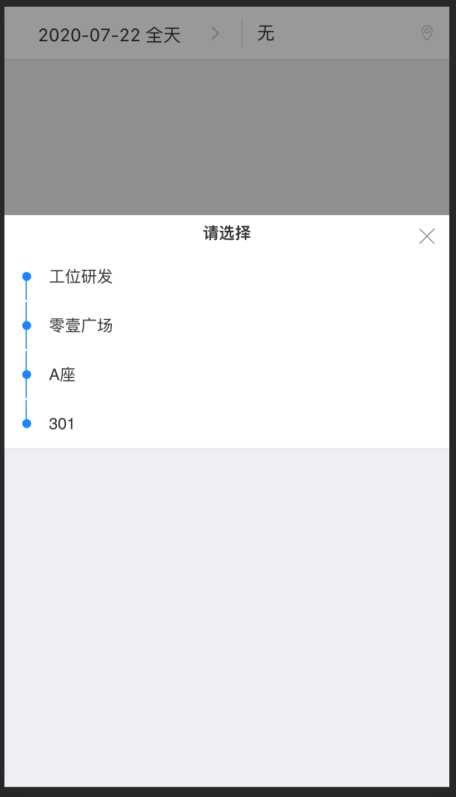

# react-position-select
position select

威发微服务位置选择组件/Wafer microservice position select component

[](https://github.com/wafersystems/react-position-select)
[](https://www.npmjs.com/package/react-position-select)
[](https://www.npmjs.com/package/react-position-select)

## 示例图片



## 如何使用

### 安装

`yarn add react-position-select`

### React 

```js
import PositionSelect from 'react-position-select';

<PositionSelect {...props}/>

```

属性  | 描述 | 类型 | 默认值
------------- | ------------- | --------------| ------------- 
spaceTree  |   空间数据（[数据](###空间数据)） | array | []
showPositionSelect | 组件是否显示 | bool | false
defaultValue | 默认初始化数据 （[数据](### 默认初始化数据)） | array |  []
onClose | 点击关闭X回调 | func | function(){}
onChange | 选择完成后回调 | func | function(data){} ,data为选中节点有序的数组
title | 弹出框title | string | '请选择'
selectTip | 选择 | string | '请选择'
selectColor   | 选择的节点颜色 | string |  #fa8c16 


### 空间数据

````
[
      {
        id: 1,
        parentId: 0,
        children: [
          {
            id: 3,
            parentId: 1,
            children: [
              {
                id: 4,
                parentId: 3,
                children: [
                  {
                    id: 5,
                    parentId: 4,
                    children: [],
                    name: '院校农信',
                  },
                  {
                    id: 6,
                    parentId: 4,
                    children: [],
                    name: '院校农信',
                  },
                  
                ],
                name: '高新农信',
              },
            ],
            name: '潍坊农信',
          },
        ],
        name: '山东农信',
      },
  ]
````

### 默认初始化数据

```
[
{id:1,parentId:0,name:'A'},
{id:2,parentId:1,name:'B'}
]


```

### 开发

````
$ git clone https://github.com/wafersystems/react-position-select.git
$ yarn
$ yarn start

````
